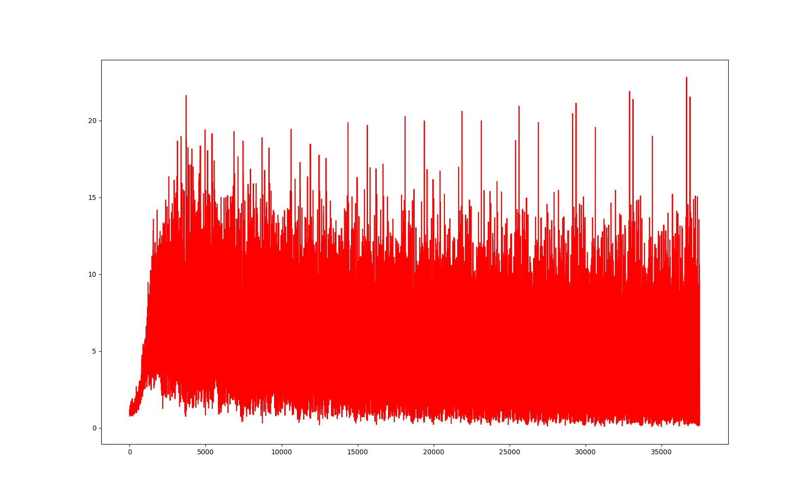

# CPSC8430_HW1
## 1 - Simulate and Train
### 1-1 Simulate a Function

### 1-2 Train on Tasks
--
## 2 - Optimization
### 2-1 Visualize the Optimization Process

### 2-2 Observe Gradient Norm

### 2-3 Compute Minimal Ratio
--
## 3 - Generalization
### 3-1 Label Randomization

### 3-2 Number of Parameters
--
### 3-3 Flatness v.s. Generalization
#### 1 - Loss, Accuracy, Cross Entropy

#### 2 - Sensitivity

